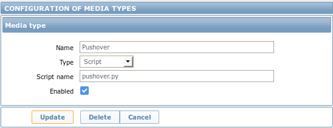

# Zabbix alert script for [Pushover](https://pushover.net/)

## Requirements

- Python 2

## Installation

- Create a Zabbix application on [Pushover](https://pushover.net/apps)
- Write application's API token to pushover.cfg
- Review other configuration options in pushover.cfg
- Create new media type in Zabbix 



- Copy pushover.py and pushover.cfg to /usr/lib/zabbix/alertscripts
- Make pushover.py executable for the user running Zabbix server

## Usage

### Zabbix

Use receiving user's Pushover client key in the _Send to_ field when 
adding a new media for a user. 

### CLI

```
usage: pushover.py [-h] [-v] [-c [C]] to subject message

Zabbix Pushover Client

positional arguments:
  to             Receiving user's key
  subject        Message subject
  message        Message body

optional arguments:
  -h, --help     show this help message and exit
  -v, --version  show program's version number and exit
  -c [C]         The configuration file to use (default: pushover.cfg)
```

## License

zabbix-pushover is licensed under the MIT License.